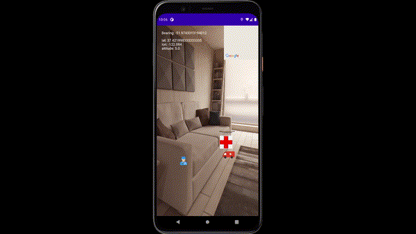

Please Notice:
-It's well-advised to run it on an Android phone, instead of the emulator. (please notice that the minSdkVersion is 21, please update if necessary)
  
-If more than 1 person has the application opened, the current user location shown on the minimap will keep changing

-Please enable location and camera permissions to use the application (It will show "Camera not found" if it cannot find the camera)

-Google Maps API key can be generated from the Credentials page [Follow the instructions here](https://developers.google.com/maps/documentation/javascript/get-api-key#:~:text=Creating%20API%20keys,-The%20API%20key&text=Go%20to%20the%20Google%20Maps%20Platform%20%3E%20Credentials%20page.&text=On%20the%20Credentials%20page%2C%20click,Click%20Close.).
It goes into the file ARActivity on line 479

-The following GIFs are a demo of the application:
-

-

Reference list:

[dat-ng GitHub](https://github.com/dat-ng/ar-location-based-android)

[Stackoverflow](https://stackoverflow.com/a/57341379)
